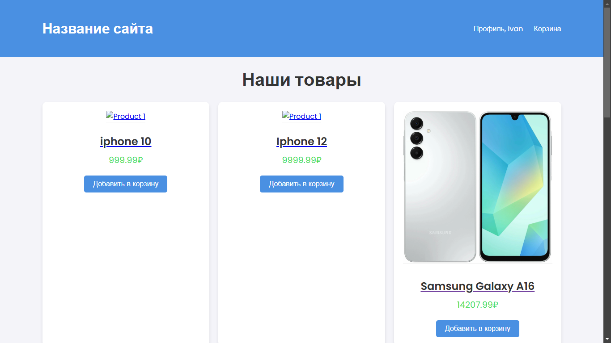
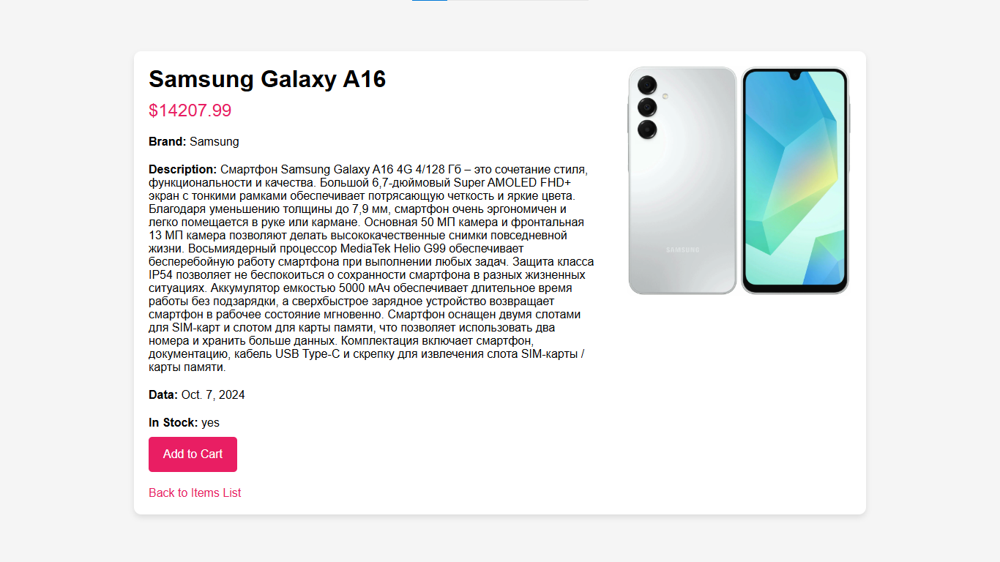
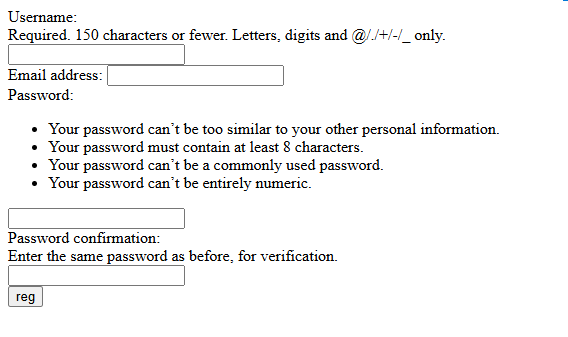
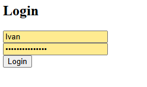

# Проект "Интернет Магазин"
## Описание
Учебный проект интернет магазина для продажи телефонов, написанный на фреймворке django
## Возможности сайта
- Регистрация пользователя
- Аутентификация и авторизация
- Добавление товаров в корзину
- Страница со всеми товарами в магазине
- Персональная страница для каждого товара
## Чему я научился
- Подключение статических файлов (css) к html шаблонам
- Настройка отображения картинок на сайте
- Регистрация пользователя с помощью форм django
- Реализация связи "многие ко многим" в моделях django
## Работа сайта
### Страница со списком всех товаров 

### Персональная страница товара

### Регистрация

### Логин

